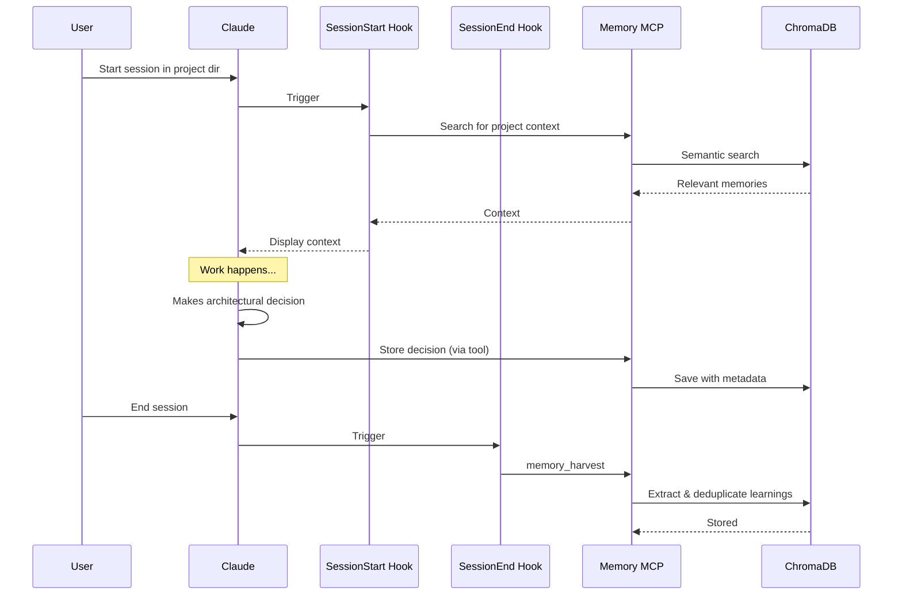

# MCP Memory Auto-Integration Design

**Date:** 2026-04-14
**Status:** Approved
**Approach:** Hybrid (Hook + Instruction-Driven)

## Problem Statement

Claude Code has MCP memory configured but doesn't use it automatically. Each session:
- Doesn't proactively search memory for project context
- Doesn't capture decisions/learnings in real-time
- Doesn't harvest session insights at the end

**Goal:** Make memory capture and retrieval automatic across all 3 profiles (personal, roku, blend).

## Design Decisions

### 1. Memory Separation Strategy: Isolated Databases

**Decision:** Each profile gets its own ChromaDB instance.

**Rationale:**
- **Security:** Roku (corporate) data must never mix with personal projects
- **Compliance:** Easier to audit/backup work data separately
- **Performance:** Smaller databases = faster searches
- **Simplicity:** Complete isolation, no tag filtering logic needed

**Implementation:**
```
~/.personal-claude/memory-db/  (personal projects only)
~/.roku-claude/memory-db/      (Roku work only - isolated)
~/.blend-claude/memory-db/     (Blend projects only)
```

### 2. Integration Approach: Hybrid (Hook + Instructions)

**Automatic (Hooks):**
- `SessionStart`: Search memory for project context
- `SessionEnd`: Extract learnings via `memory_harvest`

**Manual/Contextual (CLAUDE.md instructions):**
- Claude decides when to save during work
- Saves architectural decisions immediately
- Saves important project data (configs, URLs, integrations)

**Why Hybrid:**
- Hooks handle obvious automation (start/end)
- Claude's contextual intelligence handles "what's important"
- No performance overhead during work (only 2 hooks)
- memory_harvest at end catches anything Claude missed

## Architecture

### Component Diagram

```
┌─────────────────────────────────────────────────────────────────┐
│                    3 Claude Code Profiles                        │
│         (personal / roku / blend - isolated configs)             │
├─────────────────────────────────────────────────────────────────┤
│                                                                  │
│  Profile: personal (~/.personal-claude/)                        │
│  ├── settings.json                                              │
│  │   └── mcpServers.memory.env:                                 │
│  │       MCP_MEMORY_CHROMA_PATH=/Users/.../memory-db            │
│  ├── CLAUDE.md (memory usage instructions)                      │
│  └── hooks/                                                      │
│      ├── session-start-memory.sh   (search for context)         │
│      └── session-end-harvest.sh    (extract learnings)          │
│                                                                  │
│  Profile: roku (~/.roku-claude/)                                │
│  ├── settings.json (isolated memory-db path)                    │
│  ├── CLAUDE.md (same instructions)                              │
│  └── hooks/ (same hooks)                                        │
│                                                                  │
│  Profile: blend (~/.blend-claude/)                              │
│  ├── settings.json (isolated memory-db path)                    │
│  ├── CLAUDE.md (same instructions)                              │
│  └── hooks/ (same hooks)                                        │
└──────────────────────┬───────────────────────────────────────────┘
                       │
         ┌─────────────┼──────────────┐
         ▼             ▼              ▼
  personal-memory  roku-memory   blend-memory
   (ChromaDB)      (ChromaDB)    (ChromaDB)
```

### Memory Flow



## Implementation Details

### 1. Settings Configuration (Per Profile)

**File:** `~/.{profile}-claude/settings.json`

**Current state:**
```json
{
  "mcpServers": {
    "memory": {
      "command": "/Users/germanabuarab/anaconda3/bin/memory",
      "args": ["server"],
      "env": {
        "MCP_MEMORY_CHROMA_PATH": "/Users/germanabuarab/Library/Application Support/mcp-memory/chroma_db",
        "MCP_MEMORY_BACKUPS_PATH": "/Users/germanabuarab/Library/Application Support/mcp-memory/backups"
      }
    }
  }
}
```

**New state (isolated per profile):**
```json
{
  "mcpServers": {
    "memory": {
      "command": "/Users/germanabuarab/anaconda3/bin/memory",
      "args": ["server"],
      "env": {
        "MCP_MEMORY_CHROMA_PATH": "/Users/germanabuarab/.personal-claude/memory-db",
        "MCP_MEMORY_BACKUPS_PATH": "/Users/germanabuarab/.personal-claude/memory-backups"
      }
    }
  },
  "hooks": {
    "SessionStart": [
      {
        "hooks": [
          {
            "type": "command",
            "command": "bash /Users/germanabuarab/.personal-claude/hooks/session-start-memory.sh"
          }
        ]
      }
    ],
    "SessionEnd": [
      {
        "hooks": [
          {
            "type": "command",
            "command": "bash /Users/germanabuarab/.personal-claude/hooks/session-end-harvest.sh"
          }
        ]
      }
    ]
  }
}
```

**Repeat for:**
- `~/.roku-claude/settings.json` (with roku-specific paths)
- `~/.blend-claude/settings.json` (with blend-specific paths)

### 2. SessionStart Hook

**Purpose:** Search memory for project context at session start.

**File:** `~/.{profile}-claude/hooks/session-start-memory.sh`

```bash
#!/bin/bash

# Get current working directory name (project name)
PROJECT_NAME=$(basename "$PWD")

# Only run if we're in a project directory (not home)
if [[ "$PWD" == "$HOME" ]]; then
  exit 0
fi

# Output context for Claude
cat <<EOF
<session-start-memory-context>
Searching memory for project: $PROJECT_NAME

Use the memory MCP to search for:
1. Past decisions about this project
2. Important configurations or data
3. Patterns or conventions established

Example query: "Search memory for '$PROJECT_NAME' project decisions and configurations"
</session-start-memory-context>
EOF
```

**Why bash script, not direct MCP call:**
- Hooks can't directly invoke MCP tools
- Hook outputs text instructions for Claude
- Claude sees the instruction and uses memory MCP tool

### 3. SessionEnd Hook

**Purpose:** Extract learnings from completed session.

**File:** `~/.{profile}-claude/hooks/session-end-harvest.sh`

```bash
#!/bin/bash

# Get project name
PROJECT_NAME=$(basename "$PWD")
PROFILE_NAME=$(basename "$(dirname "$(dirname "$0")")" | sed 's/-claude//')

cat <<EOF
<session-end-harvest>
Session ended. Before closing:

1. Review this session for important learnings
2. Use memory_harvest to extract:
   - Architectural decisions
   - Bugs discovered and their root causes
   - Conventions established
   - Important project data discovered

Tag all memories with:
- project: "$PROJECT_NAME"
- profile: "$PROFILE_NAME"
- session_date: "$(date +%Y-%m-%d)"

Example: Use memory_harvest tool with tags metadata
</session-end-harvest>
EOF
```

### 4. CLAUDE.md Instructions (Per Profile)

**File:** `~/.{profile}-claude/CLAUDE.md`

**Add new section:**

```markdown
## MCP Memory Auto-Capture

You have access to semantic memory via the `memory` MCP server.

### When to Search Memory (Automatic via SessionStart)
- At session start, you'll receive a reminder to search for project context
- Use `memory_search` with the project name to find:
  - Past architectural decisions
  - Important configurations (API endpoints, DB names, etc.)
  - Established patterns and conventions
  - Known issues or gotchas

### When to Save to Memory (During Work)
Save IMMEDIATELY when you encounter or create:

**Architectural Decisions:**
- Technology choices (libraries, frameworks, tools)
- Design patterns chosen
- Trade-offs made between approaches
- System architecture changes

**Important Project Data:**
- API endpoints and integration URLs
- Configuration values (non-secret)
- Database/table/schema names
- Service names and their purposes
- Environment-specific details (dev, staging, prod)

**Conventions Established:**
- Naming conventions agreed upon
- Code organization patterns
- Git workflow decisions
- Testing strategies

**Use this format:**
```
mcp__memory__memory_store({
  "content": "Clear description of what was decided/discovered",
  "metadata": {
    "tags": "decision,project-name,relevant-tech",
    "type": "decision" | "project-data" | "convention",
    "project": "<current-project-name>",
    "profile": "personal" | "roku" | "blend"
  }
})
```

### SessionEnd Harvest (Automatic)
- At session end, you'll receive a reminder to run `memory_harvest`
- This extracts learnings from the entire session transcript
- Tag all harvested memories with project, profile, and date

### Search Priority
1. **Structured knowledge:** Check Obsidian vault first (`projects/<project>/`)
2. **Semantic recall:** Use memory MCP for fuzzy/conceptual searches
3. **Past conversations:** Use episodic-memory MCP for "what did we discuss"
```

### 5. Directory Structure (Post-Implementation)

```
~/.personal-claude/
├── settings.json (updated with isolated memory-db path + hooks)
├── CLAUDE.md (updated with memory auto-capture instructions)
├── memory-db/ (NEW - ChromaDB instance for personal)
├── memory-backups/ (NEW - backups for personal)
└── hooks/
    ├── session-start-memory.sh (NEW)
    └── session-end-harvest.sh (NEW)

~/.roku-claude/
├── settings.json (updated)
├── CLAUDE.md (updated)
├── memory-db/ (NEW - isolated Roku data)
├── memory-backups/ (NEW)
└── hooks/
    ├── session-start-memory.sh (NEW)
    └── session-end-harvest.sh (NEW)

~/.blend-claude/
├── settings.json (updated)
├── CLAUDE.md (updated)
├── memory-db/ (NEW - isolated Blend data)
├── memory-backups/ (NEW)
└── hooks/
    ├── session-start-memory.sh (NEW)
    └── session-end-harvest.sh (NEW)
```

## Data Model

### Memory Entry Schema

```typescript
interface MemoryEntry {
  content: string;                    // The actual decision/data
  content_hash: string;               // Unique ID (auto-generated)
  created_at: string;                 // ISO timestamp
  metadata: {
    tags: string;                     // Comma-separated: "decision,roku,auth"
    type: "decision" | "project-data" | "convention" | "bug" | "learning";
    project: string;                  // e.g., "cosmos", "claude-memory-hub"
    profile: "personal" | "roku" | "blend";
    session_date?: string;            // YYYY-MM-DD (for harvested memories)
    // ...other custom fields
  };
}
```

### Example Entries

**Architectural Decision:**
```json
{
  "content": "Decided to use React Query for server state management in the dashboard. Eliminates need for Redux boilerplate and provides automatic caching/refetching.",
  "metadata": {
    "tags": "decision,roku,dashboard,react-query",
    "type": "decision",
    "project": "roku-dashboard",
    "profile": "roku"
  }
}
```

**Project Data:**
```json
{
  "content": "Dev environment API endpoint: https://api-dev.roku.internal/v2/analytics. Uses OAuth2 with client credentials flow.",
  "metadata": {
    "tags": "project-data,roku,api,dev-env",
    "type": "project-data",
    "project": "analytics-integration",
    "profile": "roku"
  }
}
```

**Convention:**
```json
{
  "content": "Team convention: All feature branches use format 'feature/JIRA-123-description'. Always squash merge to main.",
  "metadata": {
    "tags": "convention,roku,git-workflow",
    "type": "convention",
    "project": "team-standards",
    "profile": "roku"
  }
}
```

## Privacy & Security

### Data Isolation

| Profile | Memory DB Path | Access Scope | Confidentiality |
|---------|---------------|--------------|-----------------|
| **personal** | `~/.personal-claude/memory-db/` | Personal projects, D&D, side projects | Low (personal data) |
| **roku** | `~/.roku-claude/memory-db/` | Roku work only | **HIGH (corporate confidential)** |
| **blend** | `~/.blend-claude/memory-db/` | Blend projects | Medium (client work) |

### Security Measures

1. **Physical separation:** No shared database = no cross-contamination risk
2. **No cloud sync:** ChromaDB stays local, never uploaded
3. **Profile tagging:** Even within a DB, all entries tagged with profile name
4. **Backup isolation:** Each profile has its own backup directory
5. **Access control:** File permissions on `~/.roku-claude/memory-db/` should be `700` (user-only)

### Sensitive Data Handling

**DO NOT store:**
- Passwords, API keys, secrets (use environment variables + 1Password)
- PII (names, emails, addresses)
- Internal IP addresses (store as "internal API endpoint" without actual IP)

**DO store:**
- Service names ("payment-gateway", "user-service")
- Architecture patterns ("uses event-driven architecture with Kafka")
- Non-sensitive config ("MongoDB database name: analytics_prod")

## Testing Strategy

### Manual Testing Checklist

**Phase 1: Configuration**
- [ ] Update settings.json for all 3 profiles with isolated memory-db paths
- [ ] Create hook scripts (session-start-memory.sh, session-end-harvest.sh)
- [ ] Update CLAUDE.md for all 3 profiles with memory instructions
- [ ] Verify memory MCP starts correctly in each profile

**Phase 2: SessionStart Hook**
- [ ] Start session in a project directory
- [ ] Verify hook outputs context search reminder
- [ ] Manually use memory_search to verify it works
- [ ] Confirm correct DB path is being used (check ChromaDB files)

**Phase 3: Manual Capture**
- [ ] Make a fake architectural decision
- [ ] Claude should save it to memory MCP with proper tags
- [ ] Search for it to verify it was stored
- [ ] Check it's in the correct profile's DB

**Phase 4: SessionEnd Hook**
- [ ] End a session with some work done
- [ ] Verify harvest reminder appears
- [ ] Run memory_harvest (or let Claude do it)
- [ ] Verify learnings were extracted and stored

**Phase 5: Cross-Profile Isolation**
- [ ] Store a memory in roku profile
- [ ] Switch to personal profile
- [ ] Search for that memory — should NOT appear
- [ ] Verify separate ChromaDB directories exist

## Migration Plan

### Current State
- All 3 profiles share: `/Users/germanabuarab/Library/Application Support/mcp-memory/chroma_db`
- No hooks for automatic capture
- No CLAUDE.md instructions for memory usage

### Migration Steps

**Step 1: Backup existing shared DB**
```bash
cp -r "/Users/germanabuarab/Library/Application Support/mcp-memory/chroma_db" \
      "/Users/germanabuarab/Library/Application Support/mcp-memory/chroma_db.backup-$(date +%Y%m%d)"
```

**Step 2: Create isolated memory directories**
```bash
mkdir -p ~/.personal-claude/memory-db
mkdir -p ~/.personal-claude/memory-backups
mkdir -p ~/.roku-claude/memory-db
mkdir -p ~/.roku-claude/memory-backups
mkdir -p ~/.blend-claude/memory-db
mkdir -p ~/.blend-claude/memory-backups
```

**Step 3: Update settings.json (all 3 profiles)**
- Change `MCP_MEMORY_CHROMA_PATH` to profile-specific path
- Change `MCP_MEMORY_BACKUPS_PATH` to profile-specific path
- Add SessionStart and SessionEnd hooks

**Step 4: Create hook scripts (all 3 profiles)**
- Create `hooks/session-start-memory.sh`
- Create `hooks/session-end-harvest.sh`
- Make executable: `chmod +x ~/.{profile}-claude/hooks/*.sh`

**Step 5: Update CLAUDE.md (all 3 profiles)**
- Add "MCP Memory Auto-Capture" section

**Step 6: Test each profile**
- Start session in personal profile, verify hooks work
- Start session in roku profile, verify isolation
- Start session in blend profile, verify isolation

**Step 7: (Optional) Migrate existing memories**
If the shared DB has valuable memories:
- Export memories with `memory` CLI (if available)
- Tag each by profile (manual step)
- Import into respective profile DBs

OR: Start fresh (recommended — existing DB is empty anyway)

## Success Criteria

✅ **Automatic Context Retrieval:**
- Starting a session in any project automatically suggests searching memory
- Relevant past decisions/data appear without manual searching

✅ **Real-Time Capture:**
- Claude saves architectural decisions during work (no reminder needed)
- Important project data gets captured as discovered

✅ **Session Harvest:**
- At session end, learnings are automatically extracted
- Harvested memories tagged with project, profile, date

✅ **Profile Isolation:**
- Roku memories never appear in personal profile searches
- Each profile has its own ChromaDB instance

✅ **Search Quality:**
- Semantic search finds relevant memories even with different wording
- Memories tagged properly for filtering

## Future Enhancements (Out of Scope)

- Obsidian vault promotion: Auto-promote high-quality memories to vault notes
- Memory pruning: Archive old/stale memories after 6 months
- Memory analytics: Dashboard showing capture rate, search frequency
- Cross-profile sharing: Explicit export/import for sharing personal patterns with work
- LLM-powered deduplication: Use Groq to merge similar memories

## Open Questions

None — design is complete and ready for implementation.
